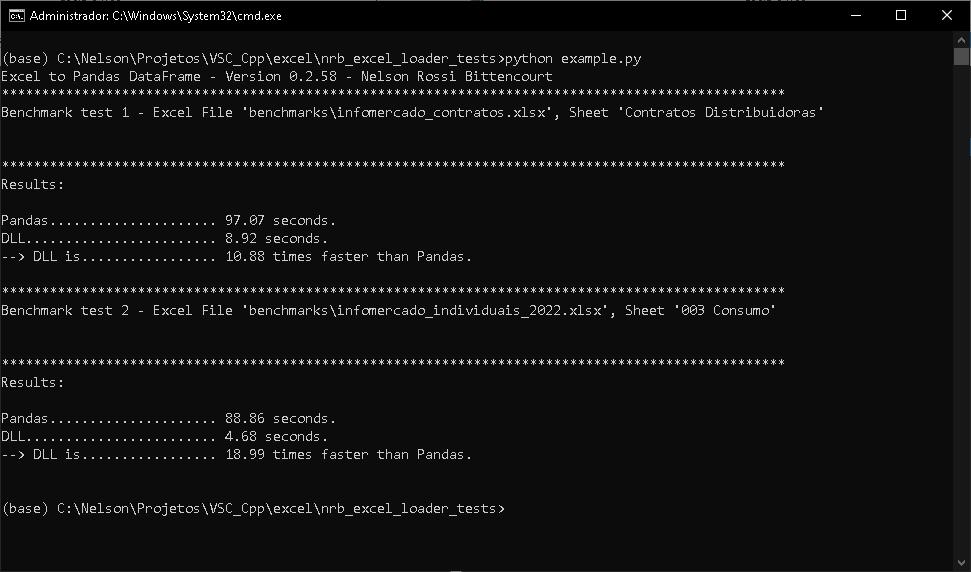
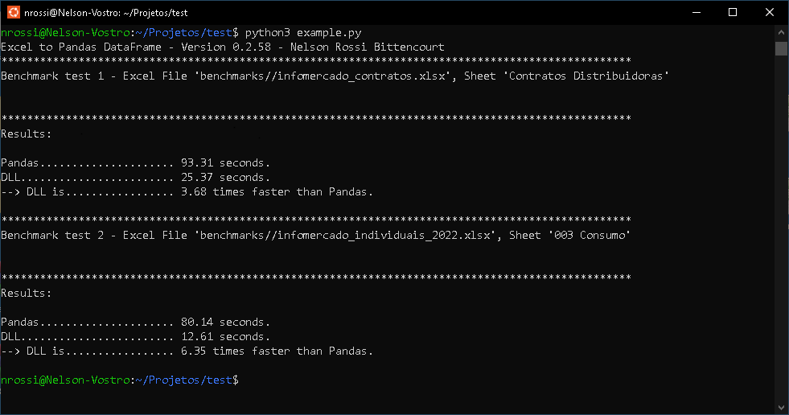

# excel_to_dataframe:
C++ Library to convert Excel worksheets to Pandas dataframes.

The code opens an Excel file, extracts data from selected worksheet and returns a formatted string semicolon separated-values 
(future version will include comma separated-values). This string can be easily handled by python/pandas.

This software is in testing phase. Feel free to test it out. If you want to share your experience, send me an email (nbittencourt@hotmail.com).

# Performance:
On an old processor (Intel Core i7-4510U 2.60 GHz, 4 cores) and with 8Gb RAM, the dll was between 5 and 20 times faster than Pandas.

##Windows, Python:

 

##Linux (Ubuntu), Python:




# Python installation (Windows and Linux):

Python 3.9, 3.10 and 3.11 are supported.

## PyPI:
```Python
pip install excel-to-dataframe
```

## Anaconda/Miniconda:
```Python
conda install -c nbittencourt excel_to_dataframe
```

To force specific python version, run one of the following:
```Python
conda install -c nbittencourt excel_to_dataframe=0.2.58=py39_0
conda install -c nbittencourt excel_to_dataframe=0.2.58=py310_0
conda install -c nbittencourt excel_to_dataframe=0.2.58=py311_0
```

#Basic usage:

This example uses 'excel_to_pandas.py' to encapsulates library functions. 
To access library functions directly, see the code in 'excel_to_pandas.py'.
To a full functional example, see 'example.py'.


```Python
# Including library to our code:
import excel_to_dataframe.excel_to_pandas as etd   

# Test access to library printing version:
print(etd.version())

# Opening an Excel Workbook:
# Function 'open_excel' will return:
# 	 0 	- success;
#   -1 	- file not found or
#   -2 	- file found, but it isn't a Excel valid file.
ret = etd.open_excel(<excel_file_full_path>) 

# Loading data from worksheet:
# Function 'ws_to_df' will return:
# A Pandas dataframe if success or -1 otherwise
my_pandas_dataframe_1 = etd.ws_to_df(<excel_worksheet_name_1>) 
my_pandas_dataframe_2 = etd.ws_to_df(<excel_worksheet_name_2>) 

# Closing an Excel Workbook. This is mandatory to change from an Excel File to another.
etd.close_excel()

```

# Personal site:
http://www.nrbenergia.somee.com/  

or

https://nrbenergia.azurewebsites.net/

# More info:
https://www.linkedin.com/in/nelsonrossibittencourt/
